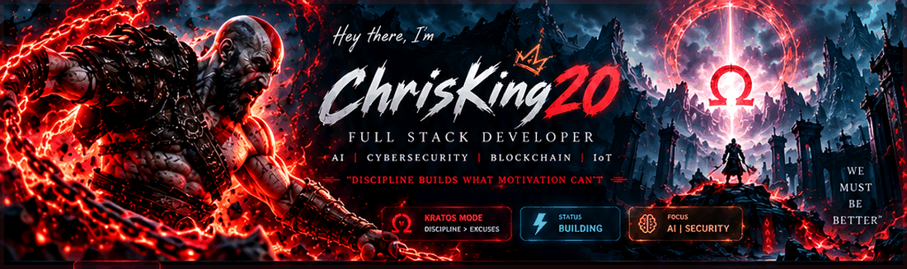
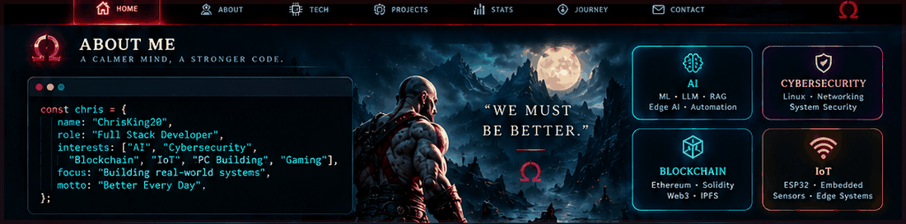
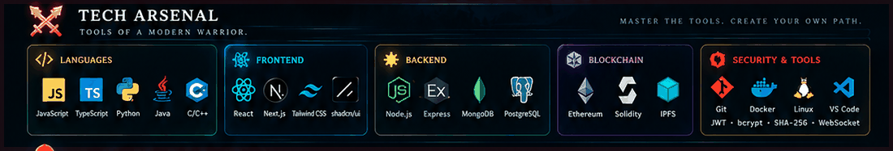
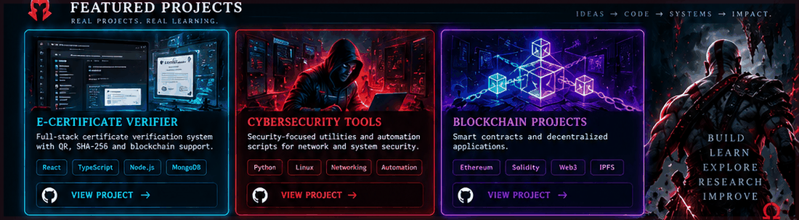
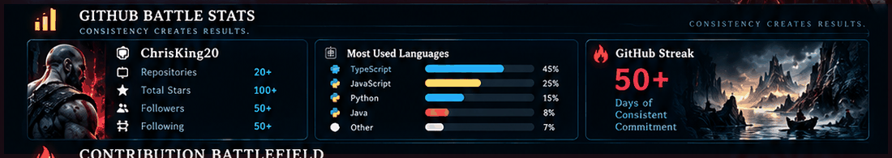
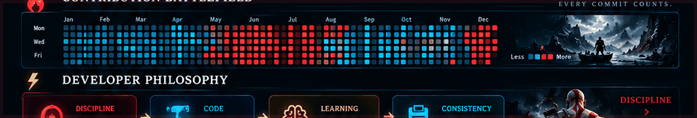
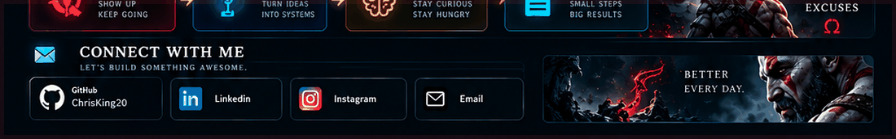

<div align="center">



<br><br>


<br><br>

<a href="https://github.com/ChrisKing20">

</a>
&nbsp;
<a href="https://github.com/ChrisKing20">

</a>
&nbsp;
<a href="https://github.com/ChrisKing20">

</a>

<br><br>

### `BUILD • LEARN • EXPLORE • RESEARCH • IMPROVE`

</div>

---

<div align="center">

# ⚔️ CHRISKING20

### `FULL STACK DEVELOPER • SYSTEM BUILDER • TECHNOLOGY EXPLORER`

> **“We must be better.”**

I build practical software systems, experiment with emerging technologies,
and continuously turn ideas into working projects.

<br>

`AI` • `CYBERSECURITY` • `BLOCKCHAIN` • `IoT` • `WEB3` • `FULL STACK`

<br><br>


</div>

---

# 🧬 01 — DEVELOPER PROFILE

<div align="center">



</div>

```ts
const chris = {
  identity: "ChrisKing20",

  role: "Full Stack Developer",

  mission:
    "Build real-world systems and master new technologies",

  interests: [
    "AI",
    "Cybersecurity",
    "Blockchain",
    "IoT",
    "PC Building",
    "Gaming"
  ],

  languages: [
    "JavaScript",
    "TypeScript",
    "Python",
    "Java",
    "C/C++"
  ],

  development: {
    frontend: [
      "React",
      "Next.js",
      "Tailwind CSS",
      "Vite",
      "shadcn/ui"
    ],

    backend: [
      "Node.js",
      "Express.js",
      "WebSocket"
    ],

    databases: [
      "MongoDB",
      "PostgreSQL"
    ],

    blockchain: [
      "Ethereum",
      "Solidity",
      "ethers.js",
      "IPFS"
    ],

    security: [
      "JWT",
      "bcrypt",
      "SHA-256",
      "QR Verification"
    ],

    tools: [
      "Git",
      "Docker",
      "Linux",
      "VS Code"
    ]
  },

  currentFocus:
    "Building real-world projects and learning new technologies",

  philosophy:
    "Discipline builds what motivation can't."
};
```

<div align="center">

### 🧠 BUILD • LEARN • EXPLORE • RESEARCH

| 🏗️ BUILD | 🧠 LEARN | 🌐 EXPLORE | 🔬 RESEARCH |
|:---:|:---:|:---:|:---:|
| Full-Stack Apps | AI / ML | Blockchain | RAG |
| Real Systems | Cybersecurity | Web3 | LLM Apps |
| Automation | Edge AI | IoT | Computer Vision |

</div>

---

# ⚔️ 02 — TECH ARSENAL

<div align="center">



<br><br>

### 💻 LANGUAGES


<br><br>

### 🎨 FRONTEND ENGINEERING


<br><br>

### ⚙️ BACKEND & DATABASE


<br><br>

### ⛓️ BLOCKCHAIN & WEB3


<br><br>

### 🐧 SYSTEMS & DEVELOPMENT TOOLS


<br><br>

`JWT` `bcrypt` `SHA-256` `QR Verification` `WebSocket` `IPFS`

</div>

### 🧩 Engineering Areas

<table>
<tr>
<td width="25%" align="center">

### 🤖 AI

`ML`  
`RAG`  
`LLM`  
`Computer Vision`  
`Edge AI`

</td>

<td width="25%" align="center">

### 🛡️ SECURITY

`Linux`  
`Networking`  
`Automation`  
`System Security`  
`Defensive Tools`

</td>

<td width="25%" align="center">

### ⛓️ WEB3

`Ethereum`  
`Solidity`  
`ethers.js`  
`IPFS`  
`Smart Contracts`

</td>

<td width="25%" align="center">

### 📡 IoT

`ESP32`  
`Embedded Systems`  
`Sensors`  
`BLE`  
`Edge Computing`

</td>
</tr>
</table>

---

# 🗡️ 03 — FEATURED PROJECTS

<div align="center">



</div>

## 🎓 E-Certificate Verifier

> **A full-stack digital certificate verification platform.**

The system is designed around certificate authenticity, unique identification,
document verification and duplicate detection.

### 🔐 Core Capabilities

- Certificate number verification
- PDF certificate upload
- QR-based verification
- SHA-256 certificate hashing
- Duplicate certificate detection
- Admin workflows
- Database-backed verification
- Blockchain-ready architecture

### 🧱 Technology Stack

```text
Frontend
React • TypeScript • Vite • Tailwind CSS

Backend
Node.js • Express.js • TypeScript

Database
MongoDB • Mongoose

Verification
SHA-256 • PDF Processing • QR Verification

Security
JWT • bcrypt • Rate Limiting • MIME Validation
```

---

## 🛡️ Cybersecurity Tools

> **Security-focused utilities, automation and system experiments.**

### Focus Areas

- 🔍 Security analysis
- 🐧 Linux tooling
- 🌐 Network utilities
- ⚙️ Automation
- 🔒 Defensive security
- 📡 System monitoring
- 🧰 Command-line utilities

### Technology

`Python` `Linux` `Networking` `Automation` `System Security`

---

## ⛓️ Blockchain Projects

> **Experiments with decentralized applications and Web3 systems.**

### Exploration Areas

- Smart contracts
- Ethereum development
- Solidity
- Web3 applications
- ethers.js
- IPFS
- On-chain verification

```text
IDEA
  ↓
SMART CONTRACT
  ↓
BLOCKCHAIN
  ↓
WEB3 APPLICATION
  ↓
DECENTRALIZED SYSTEM
```

---

## 🤖 AI / EDGE EXPLORATION

> **Learning and experimenting with intelligent systems.**

### Current Areas

- Machine Learning
- TinyML
- RAG systems
- LLM applications
- Computer Vision
- Edge AI
- AI automation
- Intelligent IoT

---

# 🧭 04 — CURRENT MISSION

<div align="center">

### THE NEXT LEVEL

</div>

```text
┌──────────────────────────────────────────────────────────┐
│                                                          │
│  [ BUILD ]                                               │
│  Real-world full-stack applications                      │
│                                                          │
│  [ LEARN ]                                               │
│  AI • ML • Cybersecurity                                 │
│                                                          │
│  [ EXPLORE ]                                             │
│  Blockchain • Web3 • IoT                                 │
│                                                          │
│  [ RESEARCH ]                                            │
│  RAG • LLM Applications • Edge AI                       │
│                                                          │
│  [ IMPROVE ]                                             │
│  Better code • Better systems • Better every day        │
│                                                          │
└──────────────────────────────────────────────────────────┘
```

### 🎯 Development Loop

<div align="center">

`IDEA` → `DESIGN` → `BUILD` → `TEST` → `LEARN` → `IMPROVE` → `REPEAT`

</div>

---

# 🔬 05 — WHAT I LIKE BUILDING

<table>
<tr>

<td width="33%" valign="top">

### 🌐 FULL STACK

- Web applications
- REST APIs
- Authentication
- Database systems
- Real-time applications
- Admin dashboards

</td>

<td width="33%" valign="top">

### 🤖 INTELLIGENT SYSTEMS

- AI applications
- RAG pipelines
- LLM systems
- Computer vision
- TinyML
- Edge AI

</td>

<td width="33%" valign="top">

### 🔐 SECURITY SYSTEMS

- Security utilities
- Linux tools
- Network utilities
- Automation
- Verification systems
- Defensive tooling

</td>

</tr>

<tr>

<td width="33%" valign="top">

### ⛓️ BLOCKCHAIN

- Smart contracts
- Ethereum
- Web3
- IPFS
- Decentralized applications
- On-chain verification

</td>

<td width="33%" valign="top">

### 📡 IoT

- ESP32
- Sensors
- BLE
- Embedded systems
- Edge processing
- IoT automation

</td>

<td width="33%" valign="top">

### 🖥️ SYSTEMS

- Linux
- Docker
- Git
- Development environments
- Custom OS experiments
- PC building

</td>

</tr>
</table>

---

# 📊 06 — GITHUB BATTLE STATS

<div align="center">



<br><br>

<a href="https://github.com/ChrisKing20">

</a>

<a href="https://github.com/ChrisKing20">

</a>

<br><br>


</div>

---

# 🔥 07 — CONTRIBUTION BATTLEFIELD

<div align="center">


<br><br>

### EVERY COMMIT IS ANOTHER STEP FORWARD.

`CODE` → `COMMIT` → `LEARN` → `IMPROVE`

</div>

---

# 🧠 08 — DEVELOPMENT MINDSET

<table>
<tr>

<td width="25%" align="center">

### ⚔️ DISCIPLINE

Show up.  
Keep building.  
Keep moving.

</td>

<td width="25%" align="center">

### 💻 CODE

Turn ideas  
into working  
systems.

</td>

<td width="25%" align="center">

### 🧠 LEARNING

Stay curious.  
Experiment.  
Understand.

</td>

<td width="25%" align="center">

### 🔥 CONSISTENCY

Small steps.  
Long-term growth.  
Better systems.

</td>

</tr>
</table>

---

# ⚡ 09 — DEVELOPER PHILOSOPHY

<div align="center">



<br><br>

### `DISCIPLINE • CODE • LEARNING • CONSISTENCY`

> **“A calm mind, a stronger code.”**

<br>

### ⚔️ `DISCIPLINE > EXCUSES`

<br>

**Motivation starts the journey.  
Discipline keeps it moving.**

</div>

---

# 🧪 10 — EXPERIMENTATION LAB

```text
┌────────────────────────────────────────────────────────────┐
│                    EXPERIMENTATION LAB                     │
├────────────────────────────────────────────────────────────┤
│                                                            │
│  AI              → RAG • LLM • ML • Edge AI               │
│                                                            │
│  SECURITY        → Linux • Networking • Automation        │
│                                                            │
│  BLOCKCHAIN      → Ethereum • Solidity • Web3             │
│                                                            │
│  IoT             → ESP32 • BLE • Sensors • Edge           │
│                                                            │
│  SYSTEMS         → Linux • Docker • Custom OS              │
│                                                            │
│  WEB             → React • Next.js • Node.js • APIs       │
│                                                            │
└────────────────────────────────────────────────────────────┘
```

---

# 🚀 11 — LEARNING ROADMAP

<div align="center">

| AREA | NOW | NEXT |
|:---:|:---:|:---:|
| Full Stack | █████████░ | Advanced Architecture |
| AI / ML | ███████░░░ | Production AI |
| Cybersecurity | ████████░░ | Advanced Security |
| Blockchain | ██████░░░░ | Advanced Web3 |
| IoT | ██████░░░░ | Edge Intelligence |
| Linux | ████████░░ | Systems Engineering |

</div>

> **The goal isn't to know everything. The goal is to keep becoming better.**

---

# 🏆 12 — PROJECT PRINCIPLES

```text
01. Build something real.
02. Understand what you build.
03. Keep security in mind.
04. Prefer practical experimentation.
05. Learn from failed implementations.
06. Improve the system instead of only adding features.
07. Document the journey.
08. Keep building.
```

---

# 📫 13 — CONNECT WITH ME

<div align="center">



<br><br>

<a href="https://github.com/ChrisKing20">

</a>

<br><br>


<br><br>

### LET'S BUILD SOMETHING AWESOME.

</div>

---

<div align="center">


<br><br>

# ⚔️ CHRISKING20

### `FULL STACK • AI • SECURITY • BLOCKCHAIN • IoT`

<br>

### **BUILD. LEARN. EXPLORE. REPEAT.**

<br>

> **“We must be better.”**

<br>

### ⚔️ `KRATOS MODE: DISCIPLINE > EXCUSES`

</div>
